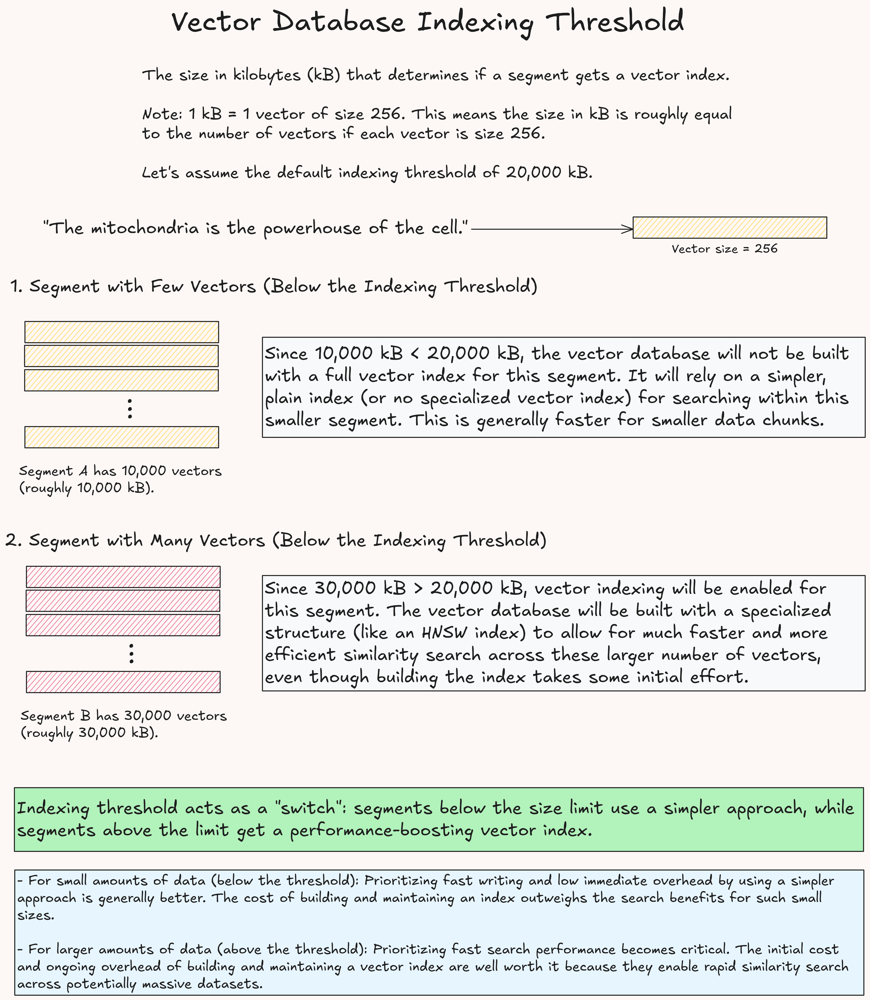

# *Not Just Another* Collection of Retrieval Augmented Generation (RAG) Applications
This repository contains a collection of applications that utilize Retrieval Augmented Generation (RAG) techniques. The goal is to provide a comprehensive set of examples and use cases for RAG, showcasing its capabilities and potential applications in various domains.

### Project 1: RAG for Contextual Question Answering with Page Annotations
This project demonstrates how to use RAG to answer questions based on a set of documents. The answer is generated using an autoregressive language model interleaved with page annotations, and the relevant documents are retrieved using a vector database.
- **Learnings**:
    - **Indexing threshold of a vector database** 